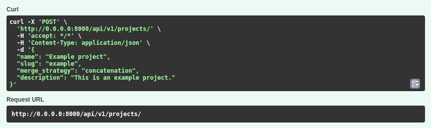
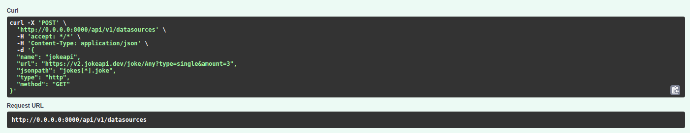
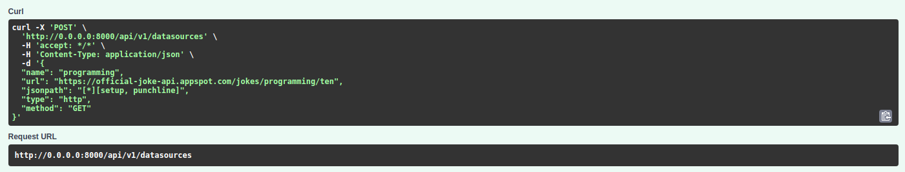
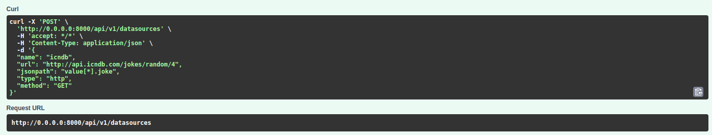
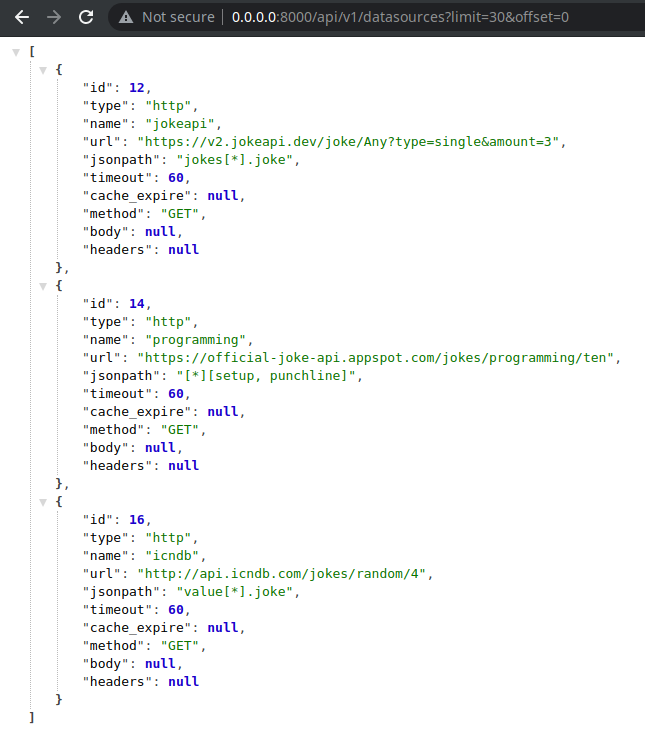
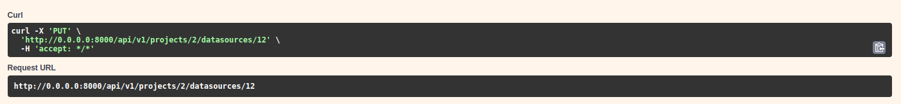
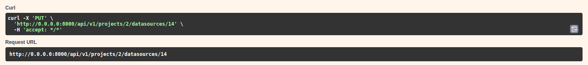
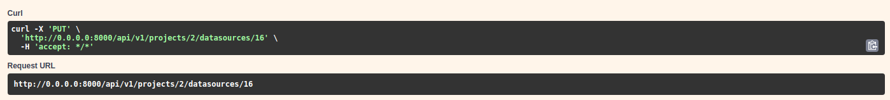
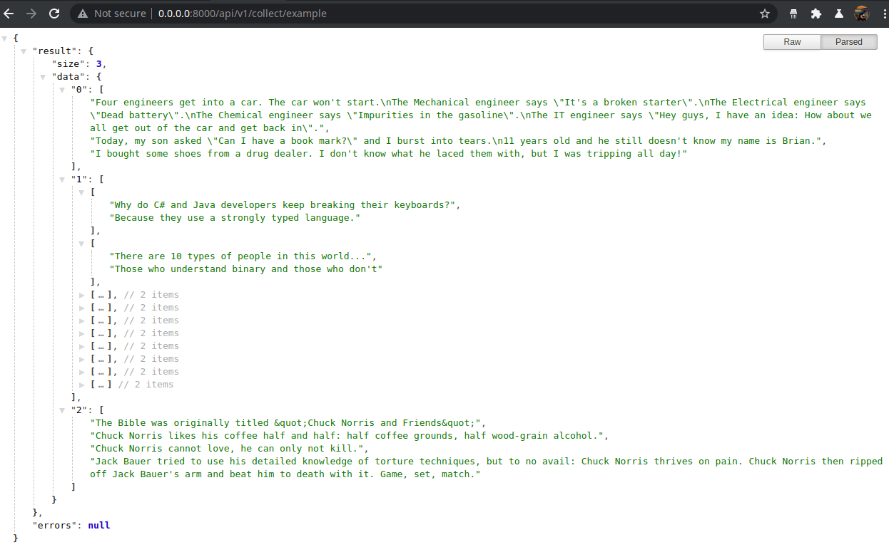

************
Usage
************
Example of usage of Apixy backend.

Create a project
----------------
Create a new empty project

Create a data source
---------------------
Create 3 independent data source (REST api)

Data source check
------------------
Check contents of the database and if the resources are added as they should.

Assign resources
------------------
Assign all data resources to the project.

Fetch example
------------------
Call aggregation to a project. Fetch a example of a project.

